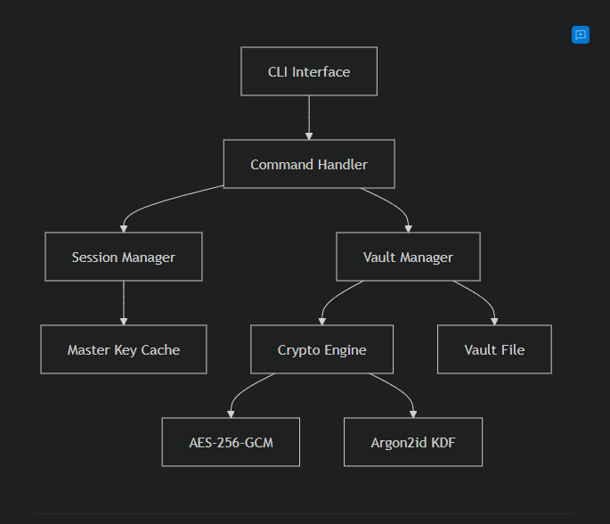

<p align="center">
  
</p>

<h1 align="center">Kookie</h1>

<p align="center">
  <strong>A secure, local-first, encrypted secret manager for developers.</strong>
</p>

<p align="center">
  <a href="#installation">Installation</a> •
  <a href="#quick-start">Quick Start</a> •
  <a href="#commands">Commands</a> •
  <a href="#security">Security</a> •
  <a href="#architecture">Architecture</a>
</p>

---

## Why "Kookie"?

The name **Kookie** holds a special meaning. It's a word that reminds me of something irreplaceable in my life-something I never want to forget. Every time I hear it, it brings a sense of warmth and purpose. It's a word I never get tired of.

Beyond the personal connection, "Kookie" is derived from **cookie**-just like how browsers store cookies to remember you, Kookie stores your secrets to protect you. But unlike browser cookies, your secrets never leave your machine unencrypted.

---

## What is Kookie?

As a developer, you juggle countless secrets every day: API keys, database passwords, JWT secrets, OAuth tokens, SSH keys, and private notes. Over time, these get scattered across `.env` files, random text files, browser password managers, and that one sticky note you swore you'd throw away.

**Kookie** solves this chaos.

It's a **command-line vault** that lives on your machine. Everything is encrypted with military-grade cryptography. Your master password is the only key-it's never stored, never transmitted, never recoverable. If you forget it, your secrets are gone forever. That's not a bug; that's a feature.

Kookie is designed for developers who want:

- **One place** for all secrets
- **Zero trust** in cloud services
- **Full control** over their data
- **Developer-friendly** CLI workflows

---

## Features

| Feature                   | Description                                                      |
| ------------------------- | ---------------------------------------------------------------- |
| **Strong Encryption**     | AES-256-GCM with Argon2id key derivation                         |
| **Multiple Secret Types** | Passwords, API keys, notes, database credentials, tokens         |
| **Session Management**    | Configurable unlock timeout (don't re-enter password every time) |
| **Developer Tools**       | JWT secret generator, random key generator, password generator   |
| **Clipboard Support**     | Copy secrets directly to clipboard with one command              |
| **Self-Installing**       | Run `kookie install` and it adds itself to PATH                  |
| **Cross-Platform**        | Works on Windows, Linux, macOS, and even Termux                  |

---

## Installation

### Quick Install (Recommended)

Download `kookie.exe` (or build from source), then run:

```bash
# Self-install: copies to system location and adds to PATH
kookie install
```

That's it! Restart your terminal and `kookie` will be available globally.

### Build from Source

```bash
# Clone and build
git clone https://github.com/sa001gar/kookie-cli
cd kookie-cli
cargo build --release

# Self-install (adds to PATH automatically)
./target/release/kookie install
```

| Platform    | Install Location         | PATH Update                                       |
| ----------- | ------------------------ | ------------------------------------------------- |
| Windows     | `%LOCALAPPDATA%\kookie\` | Windows Registry                                  |
| Linux/macOS | `~/.local/bin/`          | Shell config (`.bashrc`, `.zshrc`, `config.fish`) |

### Uninstall

```bash
kookie uninstall
```

---

## Quick Start

```bash
# Initialize your vault (creates encrypted storage)
kookie init

# Add a password
kookie add --password

# List all secrets
kookie list

# Get a specific secret
kookie get my-password-name

# Copy to clipboard
kookie get my-password-name --copy
```

---

## Commands

### Vault Management

```bash
kookie init              # Initialize a new vault
kookie init --force      # Reinitialize (deletes existing)
kookie lock              # Lock the vault
kookie unlock            # Unlock for configured duration
kookie unlock -t 30      # Unlock for 30 minutes
```

### Adding Secrets

```bash
kookie add --password    # Add a password
kookie add --api-key     # Add an API key
kookie add --note        # Add a private note
kookie add --db          # Add database credentials
kookie add --token       # Add a token (JWT, OAuth, etc.)
```

### Listing Secrets

```bash
kookie list              # List all secrets
kookie list --passwords  # List only passwords
kookie list --api-keys   # List only API keys
kookie list --notes      # List only notes
kookie list --db         # List only database credentials
kookie list --tokens     # List only tokens
```

### Retrieving Secrets

```bash
kookie get <name-or-id>        # Display a secret
kookie get <name-or-id> --copy # Copy to clipboard
```

### Deleting Secrets

```bash
kookie delete <name-or-id>         # Delete with confirmation
kookie delete <name-or-id> --force # Delete without confirmation
```

### Generating Secrets

```bash
kookie generate jwt                    # Generate JWT secret (256-bit)
kookie generate key                    # Generate random key (32 bytes)
kookie generate key --length 64        # Generate 64-byte key
kookie generate password               # Generate password (16 chars)
kookie generate password --length 24   # Generate 24-char password
kookie generate password --symbols     # Include symbols
kookie generate api-key                # Generate API key with kk_ prefix
```

### Configuration

```bash
kookie config --show         # Show current configuration
kookie config --timeout 10   # Set unlock timeout to 10 minutes
kookie config --timeout 0    # Disable session (always ask password)
```

---

## Architecture

<p align="center">
  
</p>

Kookie is built with a modular architecture:

- **CLI Interface**: Parses commands using `clap`
- **Command Handler**: Routes to appropriate command modules
- **Session Manager**: Handles unlock timeout and key caching
- **Vault Manager**: Manages encrypted storage and CRUD operations
- **Crypto Engine**: Provides encryption (AES-256-GCM) and key derivation (Argon2id)

---

## Security

### Encryption

| Component          | Algorithm   | Parameters                                |
| ------------------ | ----------- | ----------------------------------------- |
| **Key Derivation** | Argon2id    | 64 MB memory, 3 iterations, 4 parallelism |
| **Encryption**     | AES-256-GCM | Random 96-bit nonce per encryption        |

### Storage

- All secrets are encrypted before being stored
- The vault file (`~/.kookie/vault.json`) contains only encrypted data
- Master password is never stored; only used to derive the encryption key

### Session

- Unlock session is stored with machine-specific obfuscation
- Automatically expires after configured timeout
- Can be manually cleared with `kookie lock`

---

## Vault Location

| Platform    | Location                       |
| ----------- | ------------------------------ |
| Windows     | `C:\Users\<username>\.kookie\` |
| Linux/macOS | `~/.kookie/`                   |

**Files:**

- `vault.json` - Encrypted vault data
- `config.json` - Configuration settings
- `.session` - Temporary session data (auto-expires)

---

## Future Roadmap

- [ ] Cloud sync (`kookie push/pull`) with Supabase
- [ ] Chrome extension for browser integration
- [ ] Merge conflict resolution for multi-device sync
- [ ] Team sharing with end-to-end encryption

---

## License

MIT License

---

<p align="center">
  Made with purpose. Built with Rust.
</p>
